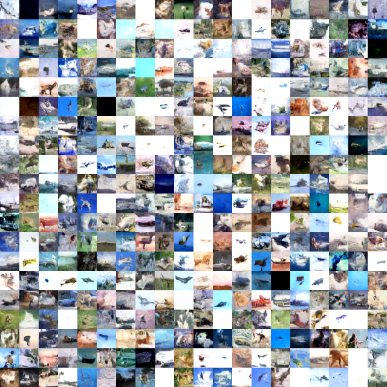
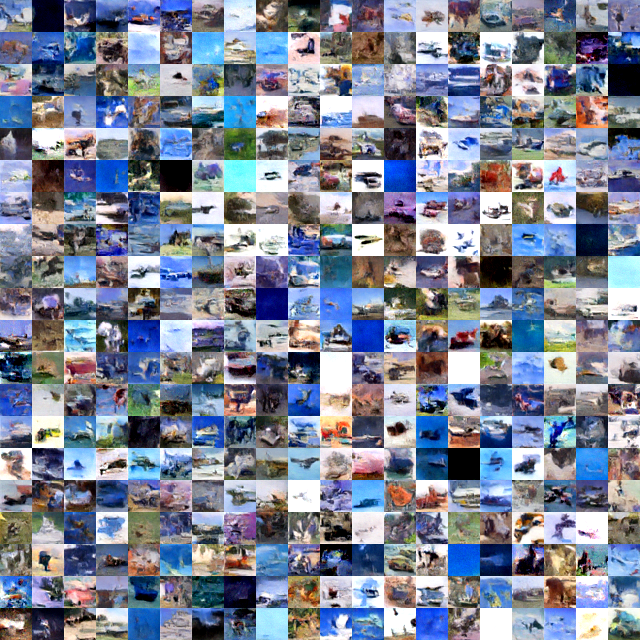
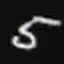
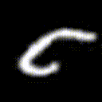
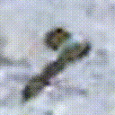
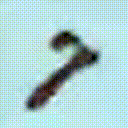
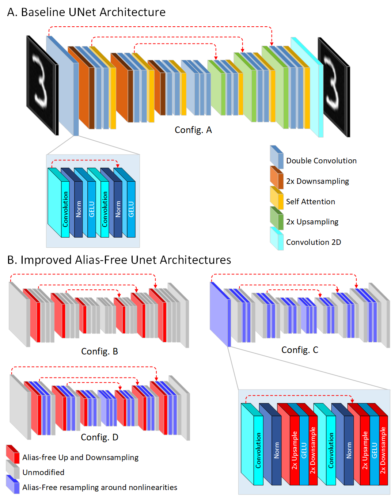

# Advancing Diffusion Models: Alias-Free Resampling and Enhanced Rotational Equivariance

This project investigates the integration of alias-free resampling techniques, inspired by StyleGAN3, into the UNet architecture of Diffusion models. Our approach focuses on improving model performance without introducing new trainable parameters, maintaining efficiency and simplicity. Our enhanced models outperform standard UNet on MNIST, CIFAR-10, and MNIST-M, with improved rotational equivariance for consistent image generation across rotations.

### Key Highlights

- **Alias-Free Resampling**: Integrated StyleGAN3-inspired, signal-processing-based alias-free resampling into the UNet architecture, enhancing performance without increasing model complexity.
- **Improved Stability and Output Quality**: Advanced filtering layers lead to more stable training and higher quality outputs.
- **Superior Performance**: Demonstrated improved performance across multiple UNet configurations on MNIST, CIFAR-10, and MNIST-M datasets.
- **Enhanced Sampling Process**: Improved the sampling process to allow user-controlled rotation of the generated images.
- **Rotation Equivariance**: Enabled consistent image generation across various rotations, showcasing the model's enhanced rotational capabilities.
- **Efficient Design**: Achieved performance improvements through strategic architectural design, avoiding the need for additional trainable parameters.

## Results
### Standard Image Synthesis

Our enhancements in the diffusion Unet architecture produces better images compared to the baseline.

<table>
  <tr>
    <td style="text-align: center;">
    
<strong>Baseline</strong>

      
    </td>
    <td style="text-align: center;">
    
<strong>Improved</strong>

      
    </td>
  </tr>
</table>

### Rotation Equivariance

We employed a novel sampling process that allows for user-controlled rotation of generated images. This approach ensures frame-to-frame consistency, enhancing the performance of our improved diffusion architecture.

<table>
  <tr>
    <td style="text-align: center;">
    
<strong>Using Baseline UNet</strong>

      
    </td>
    <td style="text-align: center;">
    
<strong>Using Improved UNet</strong>

      
    </td>
  </tr>
</table>

<table>
  <tr>
    <td style="text-align: center;">
    
<strong>Using Baseline UNet</strong>

      
    </td>
    <td style="text-align: center;">
    
<strong>Using Improved UNet</strong>

      
    </td>
  </tr>
</table>

## Architectural Revisions in Diffusion Models

1. **Baseline Architecture** (Config A | `version=0`)
2. **Alias-Free Resampling** (Config B | `version=1`)
3. **Enhanced Nonlinearities via Alias-Free Resampling** (Config C | `version=2`)
4. **Combining Alias-Free Resampling and Nonlinear Enhancements** (Config D | `version=3`)
5. **Improving Rotational Consistency** (Config E)

## Theoretical Foundations

### The Role of Resampling in Nonlinear Transformations
Nonlinearities like GeLU or ReLU in the continuous domain may introduce arbitrarily high frequencies that cannot be represented in the output and a natural solution is to eliminate the offending high-frequency content by convolving with the ideal low-pass filter. However, diffusion networks utilize discrete domain data where pointwise nonlinearity is applied which does not commute with fractional transformations (such as rotation). Therefore, to temporarily approximate a continuous representation, we utilize a proper $2\times$ alias-free upsampling, apply the nonliearity in the higher resolution and finally use a $2\times$ alias-free downsampling for returning to the original discrete space.

## Codebase
Our implementation is built on top of [Diffusion-Models-pytorch](https://github.com/CakeNuthep/Diffusion-Models-pytorch), providing an easy-to-understand codebase. Unlike other implementations, our approach strictly follows Algorithm 1 from the [DDPM](https://arxiv.org/pdf/2006.11239.pdf) paper, avoiding the lower-bound formulation for sampling to maintain simplicity.

## Datasets
We trained and evaluated our models on the following datasets:

1. [CIFAR-10](https://www.kaggle.com/datasets/joaopauloschuler/cifar10-64x64-resized-via-cai-super-resolution?select=cifar10-32) (10,000 test samples | 32 $\times$ 32)
2. [MNIST](https://yann.lecun.com/exdb/mnist/) (19,999 samples | 32 $\times$ 32 | CSV format)
3. [MNIST-M](https://www.kaggle.com/datasets/aquibiqbal/mnistm/data) (6,000 samples | 32 $\times$ 32)

You can download our datasets directly from [here](https://www.dropbox.com/scl/fi/ll19yhimdi1jscbft7ttm/Diffusion-Model-Datasets.zip?rlkey=d6ahl9ry5brxd9or7rz1emugm&st=a8n19949&dl=0).

## How to Run

1. **Download the Datasets**: Download the datasets using the provided links.
2. **Prepare the Datasets**: Extract the datasets and place the root folder in the `/data` directory. For example, the MNIST-M dataset should be located in `/data/MNIST-M/`.
3. **Train the Models**: Run the `Train.ipynb` notebook.
    - Model details and training logs will be saved in the `/run` folder.
    - Sample images generated during training will be saved in the `/results` folder.
    - Final trained models will be saved in the `/models` folder.
    - Images generated by the final model will be saved in the `/images` folder.
    - Optionally, training images can be saved in the `/trdata` folder.
4. **Inspect Model Details**: Use the `Results.ipynb` notebook to inspect model details, sampling, and denoising processes.
5. **Evaluate Model Performance**: Run the `Perf_evaluation.ipynb` notebook to assess the model's performance.
