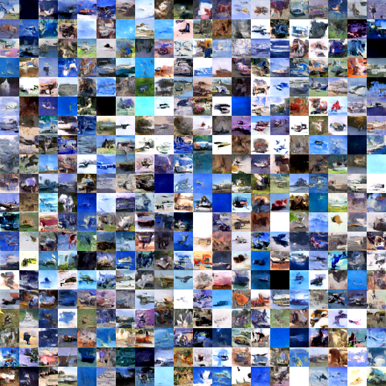
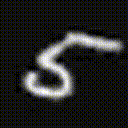
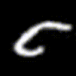
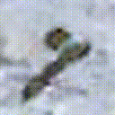
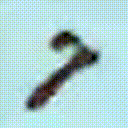

# Advancing Diffusion Models: Alias-Free Resampling and Enhanced Rotational Equivariance

This repository implements a novel approach to diffusion-based image generation by integrating alias-free resampling techniques. Recent advancements in diffusion models have brought remarkable improvements in image synthesis; however, challenges with model-induced artifacts and image fidelity stability persist. We hypothesize that the primary cause of these issues is the improper resampling operation that introduces aliasing in the diffusion model and a careful alias-free resampling dictated by image processing theory can improve the model's performance in image synthesis.

Original paper: [arxiv link](https://arxiv.org/abs/2411.09174)

Alias-Free Diffusion Model introduces alias-free resampling layers directly into the UNet architecture of diffusion models, grounded in established image processing theory. This modification requires no additional trainable parameters, keeping the model lightweight and computationally efficient.

### Key Highlights

- **Alias-Free Resampling**: Integrated StyleGAN3-inspired, signal-processing-based alias-free resampling into the UNet architecture, enhancing performance without increasing model complexity.
- **Improved Stability and Output Quality**: Advanced filtering layers lead to more stable training and higher quality outputs.
- **Superior Performance**: Demonstrated improved performance across multiple UNet configurations on MNIST, CIFAR-10, and MNIST-M datasets.
- **Enhanced Sampling Process**: Improved the sampling process to allow user-controlled rotation of the generated images.
- **Rotation Equivariance**: Enabled consistent image generation across various rotations, showcasing the model's enhanced rotational capabilities.
- **Efficient Design**: Achieved performance improvements through strategic architectural design, avoiding the need for additional trainable parameters.

You can find our implementation and codebase on [GitHub](https://github.com/MDFahimAnjum/AliasFree-Diffusion-Models-PyTorch).

## Results Overview
### Standard Image Synthesis

Our enhancements in the diffusion Unet architecture produces better images compared to the baseline.

<table>
  <tr>
    <td style="text-align: center;">
    
<strong>Baseline</strong>

      
    </td>
    <td style="text-align: center;">
    
<strong>Improved</strong>

      
    </td>
  </tr>
</table>

### Rotation Equivariance

We employed a novel sampling process that allows for user-controlled rotation of generated images. This approach ensures frame-to-frame consistency, enhancing the performance of our improved diffusion architecture.

<table>
  <tr>
    <td style="text-align: center;">
    
<strong>Using Baseline UNet</strong>

      
    </td>
    <td style="text-align: center;">
    
<strong>Using Improved UNet</strong>

      
    </td>
  </tr>
</table>

<table>
  <tr>
    <td style="text-align: center;">
    
<strong>Using Baseline UNet</strong>

      
    </td>
    <td style="text-align: center;">
    
<strong>Using Improved UNet</strong>

      
    </td>
  </tr>
</table>

## List of Architectural Revisions in Diffusion Models

1. **Baseline Architecture** (Config A | `version=0`)
2. **Alias-Free Resampling** (Config B | `version=1`)
3. **Enhanced Nonlinearities via Alias-Free Resampling** (Config C | `version=2`)
4. **Combining Alias-Free Resampling and Nonlinear Enhancements** (Config D | `version=3`)
5. **Improving Rotational Consistency** (Config E)

## Codebase
Our implementation is built on top of [Diffusion-Models-pytorch](https://github.com/CakeNuthep/Diffusion-Models-pytorch), providing an easy-to-understand codebase. Unlike other implementations, our approach strictly follows Algorithm 1 from the [DDPM](https://arxiv.org/pdf/2006.11239.pdf) paper, avoiding the lower-bound formulation for sampling to maintain simplicity.

## Datasets
We trained and evaluated our models on the following datasets:

1. [CIFAR-10](https://www.kaggle.com/datasets/joaopauloschuler/cifar10-64x64-resized-via-cai-super-resolution?select=cifar10-32) (10,000 test samples | 32 $\times$ 32)
2. [MNIST](https://yann.lecun.com/exdb/mnist/) (19,999 samples | 32 $\times$ 32 | CSV format)
3. [MNIST-M](https://www.kaggle.com/datasets/aquibiqbal/mnistm/data) (6,000 samples | 32 $\times$ 32)

You can download our datasets directly from [here](https://www.dropbox.com/scl/fi/ll19yhimdi1jscbft7ttm/Diffusion-Model-Datasets.zip?rlkey=d6ahl9ry5brxd9or7rz1emugm&st=a8n19949&dl=0).

## How to Run

1. **Download the Datasets**: Download the datasets using the provided links.
2. **Prepare the Datasets**: Extract the datasets and place the root folder in the `/data` directory. For example, the MNIST-M dataset should be located in `/data/MNIST-M/`.
3. **Train the Models**: Run the `Train.ipynb` notebook.
    - Model details and training logs will be saved in the `/run` folder.
    - Sample images generated during training will be saved in the `/results` folder.
    - Final trained models will be saved in the `/models` folder.
    - Images generated by the final model will be saved in the `/images` folder.
    - Optionally, training images can be saved in the `/trdata` folder.
4. **Inspect Model Details**: Use the `Results.ipynb` notebook to inspect model details, sampling, and denoising processes.
5. **Evaluate Model Performance**: Run the `Perf_evaluation.ipynb` notebook to assess the model's performance.

## Citation
If you use this dataset or code in your research, please cite the following paper:

    @misc{anjum2024advancingdiffusionmodelsaliasfree,
          title={Advancing Diffusion Models: Alias-Free Resampling and Enhanced Rotational Equivariance}, 
          author={Md Fahim Anjum},
          year={2024},
          eprint={2411.09174},
          archivePrefix={arXiv},
          primaryClass={cs.CV},
          url={https://arxiv.org/abs/2411.09174}, 
    }

## Theoretical Foundations

### Principles of Alias-Free Resampling
Alias-free resampling is essential for reducing artifacts in generated images by preventing aliasing. In signal processing, this technique ensures that high-frequency details are accurately represented without introducing unwanted distortions.

For models like diffusion architectures, aliasing often arises from improper downsampling, upsampling, or nonlinearities (e.g., ReLU), which can produce visible artifacts. Alias-free resampling combats this by following the **Shannon-Nyquist Sampling Theorem**—a foundational principle that ensures signals are sampled at rates that preserve their full details without overlap.

At its core, this theorem states that if we uniformly sample a signal, the sampling rate has to be at least twice the highest frequency of the signal's bandwidth.  Conversely, the bandwidth of a discrete signal has to be half the sampling rate. If the sampled signal contains frequencies beyond this limit, aliasing occurs, meaning that high-frequency components will overlap with lower frequencies, distorting the reconstructed signal.

To prevent aliasing, a low-pass filter (anti-aliasing filter) with a cutoff frequency up to the Nyquist limit is applied before resampling. This principle holds for both 1D signals and 2D images, ensuring fidelity in image generation.

### The Role of Alias-Free Resampling in Nonlinear Transformations
Nonlinear operations like GeLU or ReLU in the continuous domain introduce sudden fluctuations causing arbitrarily high frequencies that cannot be represented in the sampled output and a natural solution is to eliminate the offending high-frequency content by applying an ideal low-pass filter. However, diffusion networks utilize discrete domain data where point-wise nonlinearity is utilized which does not commute with fractional transformations (such as rotation). Therefore, to temporarily approximate a continuous representation, we utilize a proper $2\times$ alias-free upsampling, apply the nonlinearity in the higher resolution and finally use a $2\times$ alias-free downsampling equipped with low-pass anti-aliasing filter for returning to the original discrete space.

## Architectural Revisions in Diffusion Model

### Baseline Architecture (Config A)
We use a classical unconditional diffusion model with standard noising and denoising steps as our baseline. The baseline architecture is based on a UNet encoder-decoder structure with skip connections, where the input image is progressively $2\times$ downsampled to capture high-level features and subsequently $2\times$ upsampled to recover fine details. 

### Alias-Free Resampling (Config B)

First, we revise our baseline architecture (Config A) by replacing the up and downsampling layers, which do not guarantee alias-free outputs, with their alias-free versions respectively. In particular, the downsampling layers first apply low-pass anti-aliasing filters to the data as described in, and then reduce the sampling rate by uniformly removing interleaving samples. During upsampling, zeros are interleaved with the data to increase the sampling rate, followed by passing the result through a low-pass filter to remove unwanted high-frequency components. These steps are grounded in classical resampling theory from image processing. We denote this modified version as Config B, which significantly improves the quality of resampling, reducing aliasing artifacts and enhancing output fidelity.

### Enhanced Nonlinearities via Alias-Free Resampling (Config C)

Next, we shift our attention to the nonlinear components of our baseline architecture (Config. A) and revise it by introducing $2\times$ alias-free upsampling before the nonlinear ReLU or GeLU operations and $2\times$ alias-free downsampling afterward to retain the original sampling rate. These adjustments aim to mitigate aliasing introduced by the nonlinear operations while preserving high-frequency details. Importantly, the existing upsampling and downsampling layers in the network remain unmodified in this configuration (Config. C), as we only inject alias-free resampling layers around the nonlinear operations.

### Combining Alias-Free Resampling and Nonlinear Enhancements (Config D)

Here, we combine Configurations B and C by replacing the upsampling and downsampling layers in Configuration C with their alias-free counterparts from Configuration B. This ensures that both the nonlinear operations and the standard resampling processes in the network are alias-free, effectively reducing artifacts and improving image fidelity across all stages. We denote this revised architecture as Config D.

### Improving Rotational Consistency

Lastly, we revise the classical diffusion process to incorporate controlled rotation during image generation. The core idea is to progressively distribute the target rotation over the time steps. At each time step, the image is rotated by a small, constant angle, ensuring that as the diffusion progresses, the image gradually rotates towards a target orientation. This modification allows the model to generate images with user-defined rotational transformations while maintaining coherence throughout the generative process.

### Configuration Naming Scheme

In addition to the Alphabets (A-D) we use for denoting our revised UNet architecture, we also use two parameters during the naming of our models. These are the Kaiser $\beta$ value and whether or not the kernel was normalized. Specifically, the $\beta$ value is added after the configuration alphabet, indicating the specific Kaiser window parameter used. If the kernel was normalized, we append the letter 'N' at the end. For example, a model denoted as "Config B-2N" refers to Configuration B, with a Kaiser $\beta$ value of 2 and a normalized filter kernel. These naming schemes are summarized in Table with examples.

| **Name**    | **Architecture Details**                         | **Normalized** | **Kaiser β** |
|-------------|--------------------------------------------------|----------------|--------------|
| Config. A   | Baseline                                         | -              | -            |
| Config. B-0 | A + alias-free up and downsampling               | No             | 0            |
| Config. C-1N| A + alias-free resampling around nonlinearities  | Yes            | 1            |
| Config. D-2 | A + alias-free resampling around nonlinearities+ alias-free up and downsampling   | No             | 2            |

## Results

### Standard Image Synthesis Performance

### Performance Comparison on CIFAR-10, MNIST-M, and MNIST Datasets

| **Configuration** | **CIFAR-10 IS↑** | **CIFAR-10 FID↓** | **CIFAR-10 KID*↓** | **MNIST-M IS↑** | **MNIST-M FID↓** | **MNIST-M KID*↓** | **MNIST IS↑** | **MNIST FID↓** | **MNIST KID*↓** |
|-------------------|------------------|--------------------|---------------------|------------------|------------------|--------------------|---------------|----------------|------------------|
| A (Baseline)      | 4.54             | 98.77             | 5.97               | 3.76            | 85.00           | 6.23               | 1.98          | **9.61**       | **0.47**         |
| B-0               | **4.71**         | 94.23             | **5.44**           | 3.39            | 93.81           | 7.37               | 1.99          | 10.23          | 0.58             |
| C-0               | 3.75             | 129.42            | 7.92               | 3.11            | 124.10          | 9.43               | 1.94          | 14.07          | 0.96             |
| D-0               | 4.33             | 97.44             | 6.67               | 3.33            | 98.16           | 7.56               | 1.94          | 14.37          | 1.01             |
| B-1               | 4.63             | 121.45            | 6.90               | 3.40            | 94.11           | 7.40               | 1.97          | 11.00          | 0.64             |
| C-1               | 3.56             | 138.88            | 10.47              | 3.48            | 124.78          | 7.86               | 1.97          | 14.76          | 1.05             |
| D-1               | 4.32             | 108.06            | 7.42               | 3.44            | 114.27          | 8.35               | 1.98          | 16.08          | 1.12             |
| B-1N              | 4.63             | 125.71            | 6.64               | 3.71            | 100.91          | 7.53               | 1.97          | 11.62          | 0.72             |
| C-1N              | 3.99             | 107.37            | 6.96               | 3.69            | 144.41          | 9.69               | 1.96          | 15.95          | 1.23             |
| D-1N              | 4.51             | **90.21**         | 5.54               | 3.68            | 108.14          | 7.65               | 1.96          | 14.25          | 0.97             |
| B-2N              | 4.34             | 109.96            | 7.65               | **4.14**        | 88.05           | 5.47               | **2.00**      | 12.78          | 0.87             |
| C-2N              | 4.34             | 95.11             | 6.70               | 4.01            | 101.59          | 6.78               | 1.97          | 16.73          | 1.29             |
| D-2N              | 4.50             | 102.28            | 6.81               | 3.99            | **82.46**       | **5.35**           | 1.99          | 11.19          | 0.71             |

\* *IS: Inception Score, FID: Frechet Inception Distance, KID: Kernel Inception Distance* (× 100).  
*Configurations are represented as 'A' (baseline), 'B', 'C', and 'D', followed by a number representing the Kaiser window β value (0, 1, or 2), and 'N' if kernel normalization is applied.*

In summary, Config D-1N outperformed the baseline in the CIFAR-10 dataset, achieving 8.7\% FID and 7.2\% KID improvement. For the MNIST-M dataset, Config D-2N delivered the best results with 3.0\% FID and a 14.1\% KID improvement. These results highlight that just by introducing alias-free resampling into the UNet network, significant improvements in sample quality can be achieved, particularly in terms of FID and KID, which are critical indicators of generative model performance. Note that the reliability of the performance metrics (IS, FID, and KID) on MNIST data is not well-established as the MNIST dataset contains single-channel gray image data while these metrics are designed for RGB images.

### Assessing Rotational Equivariance

We conducted an initial evaluation to assess the rotational equivariance of our modified diffusion process by varying the target rotation angle and generating images through the modified diffusion process using models trained on the CIFAR-10, MNIST-M, and MNIST datasets. For each dataset, we compared two models: the baseline (Config. A) and our enhanced UNet (Config. D), with the latter theoretically offering superior robustness to rotation. Our results illustrates the promising ability of our modified diffusion process to generate images at specific rotations without any additional training where our enhanced UNet architecture showed more consistent object rotation for various angles. These results indicate that our additional filtering layers used for alias-free resampling reduce the dependency of image details on absolute pixel coordinates, enabling more coherent image rotation. While these results are encouraging, further comprehensive evaluation is required to confirm its effectiveness.